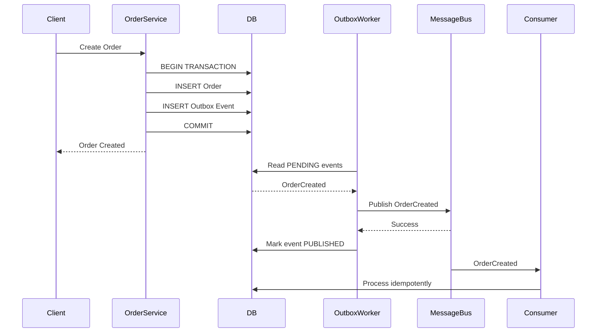
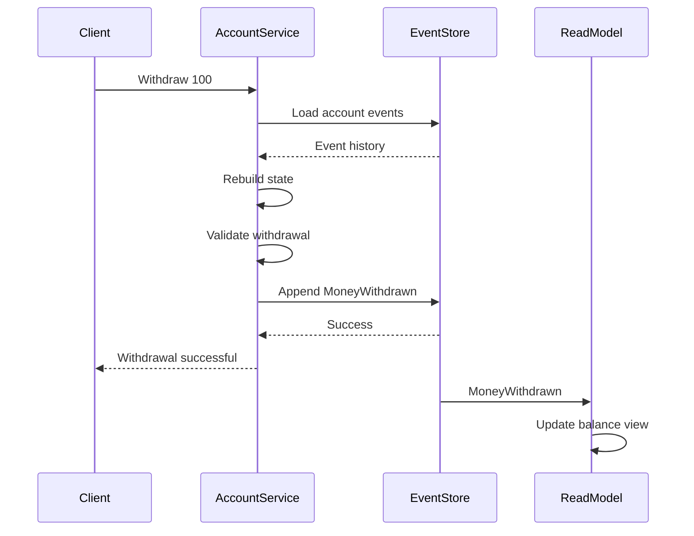
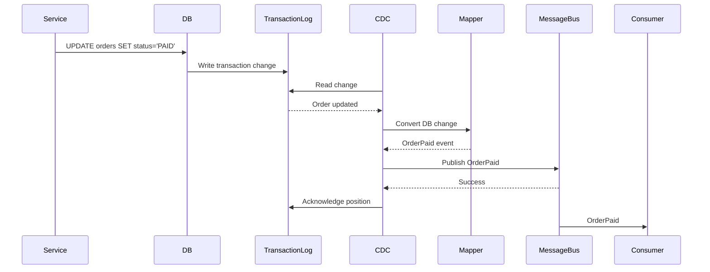
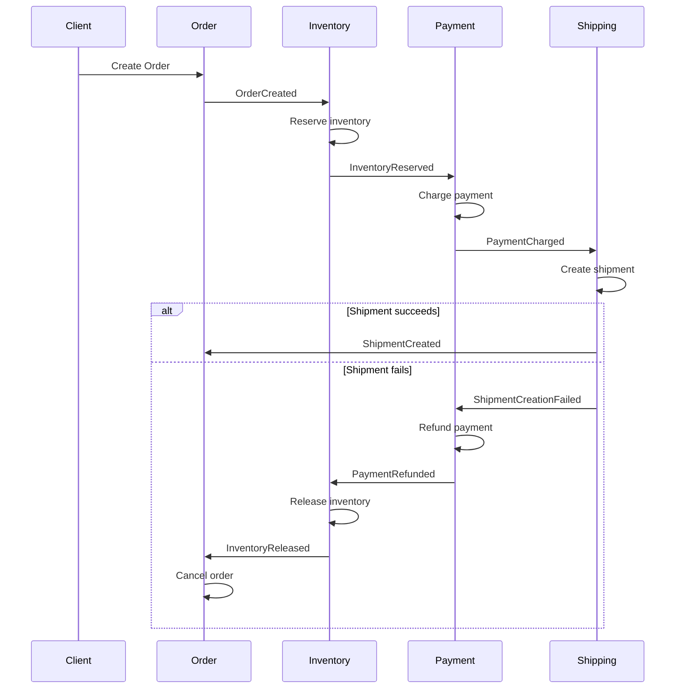
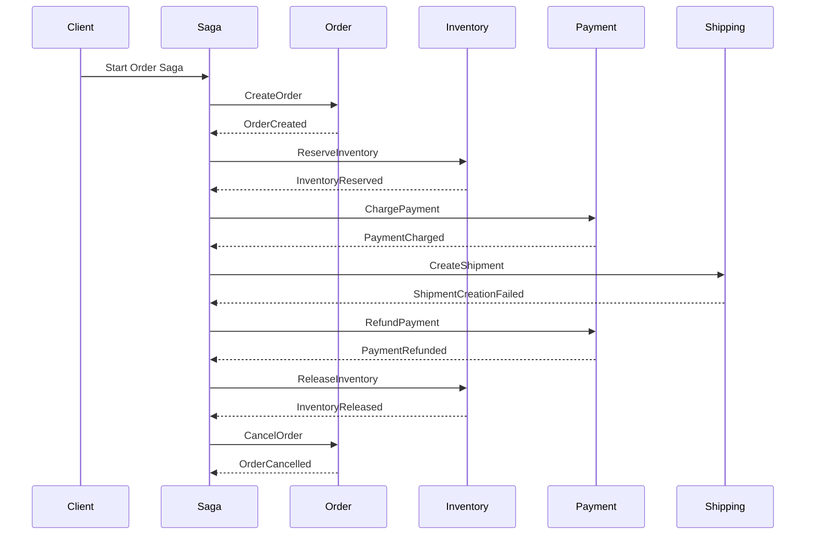

# Distributed Systems Patterns

This README covers four important distributed-systems patterns:

1. Transactional Outbox
2. Event Sourcing
3. Change Data Capture (CDC)
4. Saga Pattern
   - Choreography
   - Orchestration

All Node.js examples are intentionally **agnostic of the underlying service bus**.

---

# 1. Transactional Outbox Pattern

## What problem does it solve?

Suppose an Order Service needs to do two things:

1. Save an order in the database.
2. Publish `OrderCreated` to a message bus.

If these are done separately, a failure can leave the system inconsistent.

```text
DB transaction succeeds
        ↓
Order is saved
        ↓
Application crashes
        ↓
Message is never published
```

Or the opposite:

```text
Message is published
        ↓
Application crashes
        ↓
DB transaction fails
        ↓
Consumers believe the order exists
```

This is called the **dual-write problem**.

## Solution

Write the business data and an outbox record in the **same database transaction**.

```text
                    Same DB Transaction
                           │
             ┌─────────────┴─────────────┐
             │                           │
             ▼                           ▼
       orders table              outbox_events table
             │                           │
             │                           │
             └─────────────┬─────────────┘
                           │
                           ▼
                    Outbox Worker
                           │
                           ▼
                      Message Bus
                           │
                           ▼
                        Consumers
```

The database becomes responsible for guaranteeing that:

```text
Order + "publish this event"
```

either both exist or neither exists.

---

## Real-life example

Imagine an e-commerce system.

A customer places an order:

```text
POST /orders
```

The Order Service needs to:

```text
1. Create order
2. Publish OrderCreated
```

Instead of publishing immediately:

```js
await db.insertOrder(order);
await messageBus.publish(event);
```

we do:

```js
await db.transaction(async tx => {
  await tx.insertOrder(order);

  await tx.insertOutbox({
    type: "OrderCreated",
    payload: order
  });
});
```

Now both records are committed together.

A background worker later publishes the outbox event.

---

## PostgreSQL schema

```sql
CREATE TABLE orders (
    id UUID PRIMARY KEY,
    customer_id UUID NOT NULL,
    amount NUMERIC(10, 2) NOT NULL,
    status VARCHAR(50) NOT NULL,
    created_at TIMESTAMP NOT NULL DEFAULT NOW()
);

CREATE TABLE outbox_events (
    id UUID PRIMARY KEY,
    aggregate_type VARCHAR(100) NOT NULL,
    aggregate_id UUID NOT NULL,
    event_type VARCHAR(200) NOT NULL,
    payload JSONB NOT NULL,

    status VARCHAR(30) NOT NULL DEFAULT 'PENDING',

    created_at TIMESTAMP NOT NULL DEFAULT NOW(),
    published_at TIMESTAMP NULL,

    processing_started_at TIMESTAMP NULL,
    retry_count INTEGER NOT NULL DEFAULT 0
);
```

---

## Generic Message Bus

The implementation should not depend on Kafka, RabbitMQ, NATS, SQS, or another specific technology.

```js
class MessageBus {
  async publish(event) {
    throw new Error("MessageBus.publish() must be implemented");
  }
}
```

For example:

```js
class MyMessageBus extends MessageBus {
  async publish(event) {
    // Kafka / RabbitMQ / NATS / SQS implementation
  }
}
```

---

## Creating the order

```js
async function createOrder(db, order) {
  await db.transaction(async tx => {
    await tx.query(
      `
      INSERT INTO orders (
        id,
        customer_id,
        amount,
        status
      )
      VALUES ($1, $2, $3, $4)
      `,
      [
        order.id,
        order.customerId,
        order.amount,
        "PENDING"
      ]
    );

    await tx.query(
      `
      INSERT INTO outbox_events (
        id,
        aggregate_type,
        aggregate_id,
        event_type,
        payload
      )
      VALUES ($1, $2, $3, $4, $5)
      `,
      [
        crypto.randomUUID(),
        "Order",
        order.id,
        "OrderCreated",
        JSON.stringify(order)
      ]
    );
  });
}
```

The important part is that both operations happen inside the same database transaction.

---

## Outbox Worker

The worker periodically reads pending events.

```js
class OutboxWorker {
  constructor(db, messageBus) {
    this.db = db;
    this.messageBus = messageBus;
  }

  async process() {
    const events = await this.db.query(`
      SELECT *
      FROM outbox_events
      WHERE status = 'PENDING'
      ORDER BY created_at
      LIMIT 100
    `);

    for (const event of events.rows) {
      try {
        await this.messageBus.publish({
          id: event.id,
          type: event.event_type,
          aggregateId: event.aggregate_id,
          payload: event.payload
        });

        await this.db.query(
          `
          UPDATE outbox_events
          SET
            status = 'PUBLISHED',
            published_at = NOW()
          WHERE id = $1
          `,
          [event.id]
        );
      } catch (error) {
        await this.db.query(
          `
          UPDATE outbox_events
          SET retry_count = retry_count + 1
          WHERE id = $1
          `,
          [event.id]
        );

        console.error("Failed to publish event", {
          eventId: event.id,
          error
        });
      }
    }
  }
}
```

---

## Important: At-least-once delivery

The Outbox Pattern normally gives you:

```text
At-least-once delivery
```

not:

```text
Exactly-once delivery
```

For example:

```text
Worker publishes event
       ↓
Message bus accepts event
       ↓
Worker crashes
       ↓
Worker never marks DB row as PUBLISHED
       ↓
Worker retries
       ↓
Same event is published again
```

Therefore consumers should be **idempotent**.

---

## Consumer idempotency

One common approach is to keep a `processed_events` table.

```sql
CREATE TABLE processed_events (
    event_id UUID PRIMARY KEY,
    processed_at TIMESTAMP NOT NULL DEFAULT NOW()
);
```

Consumer:

```js
async function handleOrderCreated(db, event) {
  await db.transaction(async tx => {
    const result = await tx.query(
      `
      INSERT INTO processed_events (event_id)
      VALUES ($1)
      ON CONFLICT (event_id) DO NOTHING
      RETURNING event_id
      `,
      [event.id]
    );

    if (result.rowCount === 0) {
      return;
    }

    // Process event exactly once from the consumer's perspective.
    await tx.query(
      `
      INSERT INTO order_read_model (
        order_id,
        customer_id,
        amount
      )
      VALUES ($1, $2, $3)
      `,
      [
        event.aggregateId,
        event.payload.customerId,
        event.payload.amount
      ]
    );
  });
}
```

---

## Sequence Diagram



---

## If the Message Bus is Down

```text
Order Service
     │
     ├── DB transaction succeeds
     │
     └── Outbox event = PENDING
              │
              ▼
        Outbox Worker
              │
              ▼
        Message Bus DOWN
              │
              ▼
         Retry later
              │
              ▼
        Message Bus UP
              │
              ▼
          Publish
```

The order is not lost because the intent to publish is stored in the database.

---

## Polling vs CDC

A traditional Outbox implementation uses polling:

```text
Outbox Worker
     ↓
SELECT pending rows
     ↓
Publish
```

Another approach is:

```text
Database
   ↓
Transaction Log
   ↓
CDC
   ↓
Outbox events
   ↓
Message Bus
```

This avoids constant polling.

---

## Key mental model

> **DB state + outbox intent in the same transaction, then a background process publishes the intent.**

---

# 2. Event Sourcing

## What is Event Sourcing?

In a normal CRUD system:

```text
Database stores current state
```

For example:

```text
Account
-------
id: 123
balance: 700
```

With Event Sourcing:

```text
Events are the source of truth
```

Example:

```text
AccountOpened
MoneyDeposited(1000)
MoneyWithdrawn(200)
MoneyWithdrawn(100)
```

Current state is reconstructed by replaying those events.

```text
Events
  │
  ├── AccountOpened
  ├── MoneyDeposited(1000)
  ├── MoneyWithdrawn(200)
  └── MoneyWithdrawn(100)
             │
             ▼
       Apply events
             │
             ▼
        Balance = 700
```

---

## Real-life example

Consider a bank account.

Instead of storing only:

```text
balance = 700
```

we store:

```text
AccountOpened
MoneyDeposited 1000
MoneyWithdrawn 200
MoneyWithdrawn 100
```

The current balance is derived:

```text
0
+ 1000
- 200
- 100
= 700
```

The event history becomes the source of truth.

---

# CRUD vs Event Sourcing

## CRUD

```text
Database

Account
-------
balance = 700
```

The previous state may be lost when updated.

---

## Event Sourcing

```text
Event Store

1. AccountOpened
2. MoneyDeposited 1000
3. MoneyWithdrawn 200
4. MoneyWithdrawn 100
```

Current state is reconstructed.

---

## Event Store schema

```sql
CREATE TABLE account_events (
    id UUID PRIMARY KEY,

    aggregate_id UUID NOT NULL,

    event_type VARCHAR(200) NOT NULL,

    version INTEGER NOT NULL,

    payload JSONB NOT NULL,

    created_at TIMESTAMP NOT NULL DEFAULT NOW(),

    UNIQUE (aggregate_id, version)
);
```

The `version` is important for optimistic concurrency.

Example:

```text
Account 123

version 1 → AccountOpened
version 2 → MoneyDeposited
version 3 → MoneyWithdrawn
```

---

# Applying Events

```js
function applyEvent(state, event) {
  switch (event.eventType) {
    case "AccountOpened":
      return {
        id: event.aggregateId,
        balance: 0
      };

    case "MoneyDeposited":
      return {
        ...state,
        balance: state.balance + event.payload.amount
      };

    case "MoneyWithdrawn":
      return {
        ...state,
        balance: state.balance - event.payload.amount
      };

    default:
      throw new Error(
        `Unknown event: ${event.eventType}`
      );
  }
}
```

---

# Rebuilding State

```js
async function rebuildAccount(eventStore, accountId) {
  const events = await eventStore.getEvents(accountId);

  let state = null;

  for (const event of events) {
    state = applyEvent(state, event);
  }

  return state;
}
```

If events are:

```text
AccountOpened
MoneyDeposited(1000)
MoneyWithdrawn(200)
MoneyWithdrawn(100)
```

The result is:

```js
{
  id: "account-123",
  balance: 700
}
```

---

# Commands vs Events

This is an important distinction.

## Command

A command says:

```text
"Please do this."
```

Example:

```text
WithdrawMoney
```

## Event

An event says:

```text
"This happened."
```

Example:

```text
MoneyWithdrawn
```

Flow:

```text
Command
   ↓
Validate
   ↓
Business logic
   ↓
Event
   ↓
Event Store
```

---

# Event Store

A simple generic interface:

```js
class EventStore {
  async getEvents(aggregateId) {
    throw new Error("Not implemented");
  }

  async append(aggregateId, expectedVersion, events) {
    throw new Error("Not implemented");
  }
}
```

---

# Optimistic Concurrency

Imagine two requests read:

```text
Account version = 5
```

Both try to write version 6.

Only one should succeed.

The database can enforce:

```text
UNIQUE(aggregate_id, version)
```

Or the event store can explicitly check the expected version.

Conceptually:

```js
await eventStore.append(
  accountId,
  expectedVersion,
  newEvents
);
```

If the current version is not equal to `expectedVersion`, reject the write.

---

# CQRS and Read Models

Event Sourcing is often combined with CQRS.

```text
                 Event Store
                     │
                     │ Events
          ┌──────────┴──────────┐
          ▼                     ▼
   Order Projection       Analytics Projection
          │                     │
          ▼                     ▼
     Read Database          Data Warehouse
```

The event stream can feed multiple read models.

For example:

```text
OrderCreated
OrderPaid
OrderShipped
```

could build:

```text
Order View
Analytics View
Search Index
Customer History
```

---

# Event Sourcing + Outbox

These patterns solve different problems.

```text
Event Sourcing
      ↓
Events are source of truth
```

```text
Outbox
      ↓
Reliable publication after a DB transaction
```

They can be combined.

For example:

```text
Command
   ↓
Event Store
   ↓
Outbox / Publisher
   ↓
Message Bus
   ↓
Other Services
```

---

# Sequence Diagram



---

# Key mental model

> **Events are the source of truth; current state is a projection obtained by replaying events.**

---

# 3. Change Data Capture (CDC)

## What is CDC?

CDC means:

> **Change Data Capture**

It observes changes made to a database and turns those changes into a stream.

Instead of:

```text
Application
    ↓
Database
```

we have:

```text
Application
    ↓
Database
    ↓
Transaction Log
    ↓
CDC
    ↓
Change Stream
    ↓
Consumers
```

---

# Real-life e-commerce example

Suppose:

```text
orders.status
```

changes:

```text
PENDING
   ↓
PAID
```

The database transaction log records the change.

CDC reads the database log and produces something like:

```json
{
  "table": "orders",
  "operation": "UPDATE",
  "before": {
    "status": "PENDING"
  },
  "after": {
    "status": "PAID"
  }
}
```

The CDC processor can convert this into a domain event:

```json
{
  "type": "OrderPaid",
  "orderId": "order-123"
}
```

---

# Architecture

```text
Application
     │
     ▼
 Database
     │
     ▼
Transaction Log
     │
     ▼
    CDC
     │
     ▼
Event Mapper
     │
     ▼
MessageBus Adapter
     │
     ▼
 Consumers
```

---

# Generic CDC Source

Keep the implementation independent of the CDC technology.

```js
class CDCSource {
  async *changes() {
    throw new Error("CDCSource.changes() not implemented");
  }

  async acknowledge(position) {
    throw new Error("CDCSource.acknowledge() not implemented");
  }
}
```

---

# Generic Message Bus

```js
class MessageBus {
  async publish(message) {
    throw new Error("MessageBus.publish() not implemented");
  }
}
```

---

# Mapping Database Changes to Domain Events

```js
function mapChangeToEvent(change) {
  if (
    change.table === "orders" &&
    change.operation === "UPDATE" &&
    change.after.status === "PAID"
  ) {
    return {
      id: crypto.randomUUID(),
      type: "OrderPaid",
      aggregateId: change.after.id,
      payload: {
        orderId: change.after.id
      }
    };
  }

  return null;
}
```

---

# CDC Processor

```js
class CDCProcessor {
  constructor(cdcSource, messageBus) {
    this.cdcSource = cdcSource;
    this.messageBus = messageBus;
  }

  async start() {
    for await (const change of this.cdcSource.changes()) {
      const event = mapChangeToEvent(change);

      if (!event) {
        await this.cdcSource.acknowledge(change.position);
        continue;
      }

      try {
        await this.messageBus.publish(event);

        await this.cdcSource.acknowledge(
          change.position
        );
      } catch (error) {
        console.error(
          "Failed to publish CDC event",
          error
        );

        break;
      }
    }
  }
}
```

The important ordering is:

```text
Read change
   ↓
Publish event
   ↓
Acknowledge position
```

Only acknowledge after successful publication.

---

# Fake CDC Source

For demonstration:

```js
class FakeCDCSource extends CDCSource {
  constructor(changes) {
    super();
    this._changes = changes;
  }

  async *changes() {
    for (const change of this._changes) {
      yield change;
    }
  }

  async acknowledge(position) {
    console.log(
      "Acknowledged position:",
      position
    );
  }
}
```

---

# CDC Use Cases

CDC can be used for:

```text
Database
   │
   ├── Read Model
   ├── Search Index
   ├── Cache
   ├── Analytics
   ├── Data Warehouse
   ├── Replication
   └── Event Stream
```

---

# CDC vs Event Sourcing

This distinction is very important.

## Event Sourcing

```text
Events
  ↓
Source of truth
  ↓
Current state
```

## CDC

```text
Database
  ↓
Source of truth
  ↓
Database changes
  ↓
Events / stream
```

So:

> **Event Sourcing starts with events.**

> **CDC starts with database changes.**

---

# CDC + Outbox

CDC and Outbox can be combined.

Application:

```text
BEGIN TRANSACTION

UPDATE orders

INSERT outbox_event

COMMIT
```

Then:

```text
Database
    ↓
Transaction Log
    ↓
CDC
    ↓
Outbox Table
    ↓
Message Bus
```

This eliminates the need for a polling outbox worker.

---

# CDC Production Concerns

A production CDC implementation needs to handle:

- Resume positions
- Duplicate events
- Ordering
- Schema evolution
- Backpressure
- Consumer failures
- Replay
- Dead-letter handling
- Idempotency

Again:

```text
At-least-once
        +
Idempotent consumers
```

is a common reliability model.

---

# Sequence Diagram



---

# Key mental model

> **Watch database changes and turn them into a stream.**

---

# 4. Saga Pattern

## What problem does Saga solve?

Suppose an e-commerce order requires:

```text
1. Create Order
2. Reserve Inventory
3. Charge Payment
4. Create Shipment
```

These may belong to different services:

```text
Order Service
Inventory Service
Payment Service
Shipping Service
```

A single database transaction cannot normally span all of them.

Saga solves this by splitting the business transaction into **local transactions** and defining **compensating actions** for failures.

---

# Real-life example

Successful flow:

```text
Create Order
     ↓
Reserve Inventory
     ↓
Charge Payment
     ↓
Create Shipment
     ↓
SUCCESS
```

Suppose shipping fails:

```text
Create Order
     ↓
Reserve Inventory
     ↓
Charge Payment
     ↓
Create Shipment
     ↓
FAILED
```

We compensate:

```text
Refund Payment
     ↓
Release Inventory
     ↓
Cancel Order
```

---

# Important concept

Saga is **not database rollback**.

A compensation is a business operation.

For example:

```text
ChargePayment
```

cannot be rolled back like:

```text
ROLLBACK
```

Instead:

```text
RefundPayment
```

is executed.

Similarly:

```text
ReserveInventory
```

is compensated by:

```text
ReleaseInventory
```

---

# Saga Architecture

There are two major styles:

```text
1. Choreography
2. Orchestration
```

---

# 4.1 Saga Choreography

## What is Choreography?

There is no central coordinator.

Services listen to events and decide what to do next.

```text
Order Service
      │
      ▼
 OrderCreated
      │
      ▼
Inventory Service
      │
      ▼
InventoryReserved
      │
      ▼
Payment Service
      │
      ▼
PaymentCharged
      │
      ▼
Shipping Service
```

Each service reacts to events.

---

# Choreography Success Flow

```text
OrderCreated
     ↓
InventoryReserved
     ↓
PaymentCharged
     ↓
ShipmentCreated
```

---

# Choreography Failure Flow

Suppose shipping fails:

```text
OrderCreated
     ↓
InventoryReserved
     ↓
PaymentCharged
     ↓
ShipmentCreationFailed
     ↓
PaymentRefunded
     ↓
InventoryReleased
     ↓
OrderCancelled
```

---

# Generic Message Bus

```js
class MessageBus {
  async publish(event) {
    throw new Error("Not implemented");
  }

  async subscribe(eventType, handler) {
    throw new Error("Not implemented");
  }
}
```

The actual implementation could use any messaging technology.

---

# Order Service

```js
async function createOrder(order, messageBus) {
  // Local DB transaction
  await saveOrder(order);

  await messageBus.publish({
    type: "OrderCreated",
    correlationId: order.id,
    payload: {
      orderId: order.id
    }
  });
}
```

---

# Inventory Service

```js
async function handleOrderCreated(event, messageBus) {
  const { orderId } = event.payload;

  try {
    await reserveInventory(orderId);

    await messageBus.publish({
      type: "InventoryReserved",
      correlationId: event.correlationId,
      payload: {
        orderId
      }
    });
  } catch (error) {
    await messageBus.publish({
      type: "InventoryReservationFailed",
      correlationId: event.correlationId,
      payload: {
        orderId
      }
    });
  }
}
```

---

# Payment Service

```js
async function handleInventoryReserved(event, messageBus) {
  const { orderId } = event.payload;

  try {
    await chargePayment(orderId);

    await messageBus.publish({
      type: "PaymentCharged",
      correlationId: event.correlationId,
      payload: {
        orderId
      }
    });
  } catch (error) {
    await messageBus.publish({
      type: "PaymentFailed",
      correlationId: event.correlationId,
      payload: {
        orderId
      }
    });
  }
}
```

---

# Shipping Service

```js
async function handlePaymentCharged(event, messageBus) {
  const { orderId } = event.payload;

  try {
    await createShipment(orderId);

    await messageBus.publish({
      type: "ShipmentCreated",
      correlationId: event.correlationId,
      payload: {
        orderId
      }
    });
  } catch (error) {
    await messageBus.publish({
      type: "ShipmentCreationFailed",
      correlationId: event.correlationId,
      payload: {
        orderId
      }
    });
  }
}
```

---

# Payment Compensation

Payment listens for shipping failure.

```js
async function handleShipmentCreationFailed(
  event,
  messageBus
) {
  const { orderId } = event.payload;

  await refundPayment(orderId);

  await messageBus.publish({
    type: "PaymentRefunded",
    correlationId: event.correlationId,
    payload: {
      orderId
    }
  });
}
```

---

# Inventory Compensation

Inventory listens for payment refund.

```js
async function handlePaymentRefunded(
  event,
  messageBus
) {
  const { orderId } = event.payload;

  await releaseInventory(orderId);

  await messageBus.publish({
    type: "InventoryReleased",
    correlationId: event.correlationId,
    payload: {
      orderId
    }
  });
}
```

---

# Order Compensation

Order listens for inventory release.

```js
async function handleInventoryReleased(event) {
  const { orderId } = event.payload;

  await cancelOrder(orderId);
}
```

---

# Choreography Sequence Diagram



---

# Choreography Advantages

There is no central coordinator.

Each service owns its business logic.

The architecture can be naturally event-driven.

---

# Choreography Challenges

As the workflow becomes complex:

```text
Service A
    ↓
Service B
    ↓
Service C
    ↓
Service D
    ↓
Service A
    ↓
Service E
```

It can become difficult to understand:

```text
Who starts the next step?
Who handles failure?
Which event causes which action?
Where does compensation happen?
```

This is sometimes called a distributed workflow.

---

# 4.2 Saga Orchestration

## What is Orchestration?

Instead of services deciding what happens next, a central **Saga Orchestrator** controls the workflow.

```text
             Saga Orchestrator
               /     |      \
              /      |       \
             ▼       ▼        ▼
          Order   Inventory  Payment
                             |
                             ▼
                          Shipping
```

The orchestrator sends commands and reacts to responses/events.

---

# Commands vs Events

This distinction is important.

## Command

A command says:

```text
"Please do this."
```

Examples:

```text
CreateOrder
ReserveInventory
ChargePayment
CreateShipment
RefundPayment
ReleaseInventory
CancelOrder
```

## Event

An event says:

```text
"This happened."
```

Examples:

```text
OrderCreated
InventoryReserved
PaymentCharged
ShipmentCreated
ShipmentCreationFailed
PaymentRefunded
```

---

# Orchestration Success Flow

```text
Saga
 │
 ├── CreateOrder
 │
 ├── ReserveInventory
 │
 ├── ChargePayment
 │
 └── CreateShipment
          │
          ▼
        SUCCESS
```

---

# Orchestration Failure Flow

Suppose shipment creation fails:

```text
Saga
 │
 ├── CreateOrder
 ├── ReserveInventory
 ├── ChargePayment
 └── CreateShipment
          │
          ▼
        FAILED
          │
          ▼
      RefundPayment
          │
          ▼
      ReleaseInventory
          │
          ▼
       CancelOrder
```

---

# Simple Node.js Orchestrator

```js
class OrderSaga {
  constructor(services) {
    this.services = services;
  }

  async execute(order) {
    const state = {
      orderCreated: false,
      inventoryReserved: false,
      paymentCharged: false,
      shipmentCreated: false
    };

    try {
      await this.services.order.create(order);
      state.orderCreated = true;

      await this.services.inventory.reserve(order.id);
      state.inventoryReserved = true;

      await this.services.payment.charge(order.id);
      state.paymentCharged = true;

      await this.services.shipping.create(order.id);
      state.shipmentCreated = true;

      return {
        status: "SUCCESS"
      };
    } catch (error) {
      await this.compensate(order.id, state);

      return {
        status: "FAILED",
        error
      };
    }
  }

  async compensate(orderId, state) {
    if (state.paymentCharged) {
      await this.services.payment.refund(orderId);
    }

    if (state.inventoryReserved) {
      await this.services.inventory.release(orderId);
    }

    if (state.orderCreated) {
      await this.services.order.cancel(orderId);
    }
  }
}
```

This is a simplified example.

It is not production-safe because the state is only in memory.

---

# Durable Saga State

A production orchestrator should persist its state.

For example:

```sql
CREATE TABLE saga_instances (
    id UUID PRIMARY KEY,

    saga_type VARCHAR(100) NOT NULL,

    correlation_id UUID NOT NULL,

    state VARCHAR(50) NOT NULL,

    current_step VARCHAR(100) NOT NULL,

    data JSONB NOT NULL DEFAULT '{}',

    created_at TIMESTAMP NOT NULL DEFAULT NOW(),

    updated_at TIMESTAMP NOT NULL DEFAULT NOW()
);
```

Example:

```text
id:              saga-123
saga_type:       OrderSaga
correlation_id:  order-123
state:           RUNNING
current_step:    PAYMENT
data:            {...}
```

---

# Persistent Saga Example

```js
class PersistentOrderSaga {
  constructor(sagaStore, services) {
    this.sagaStore = sagaStore;
    this.services = services;
  }

  async run(sagaId) {
    const saga = await this.sagaStore.get(sagaId);

    if (saga.currentStep === "CREATE_ORDER") {
      await this.services.order.create(
        saga.data.order
      );

      await this.sagaStore.update(sagaId, {
        currentStep: "RESERVE_INVENTORY"
      });
    }

    if (saga.currentStep === "RESERVE_INVENTORY") {
      await this.services.inventory.reserve(
        saga.data.order.id
      );

      await this.sagaStore.update(sagaId, {
        currentStep: "CHARGE_PAYMENT"
      });
    }

    if (saga.currentStep === "CHARGE_PAYMENT") {
      await this.services.payment.charge(
        saga.data.order.id
      );

      await this.sagaStore.update(sagaId, {
        currentStep: "CREATE_SHIPMENT"
      });
    }

    if (saga.currentStep === "CREATE_SHIPMENT") {
      await this.services.shipping.create(
        saga.data.order.id
      );

      await this.sagaStore.update(sagaId, {
        currentStep: "COMPLETED",
        state: "COMPLETED"
      });
    }
  }
}
```

If the orchestrator crashes:

```text
Before crash:

current_step = CHARGE_PAYMENT

Crash
  ↓
Restart
  ↓
Read saga state
  ↓
Resume from CHARGE_PAYMENT
```

This is why durable state matters.

---

# Saga Idempotency

Distributed systems can retry commands.

Example:

```text
Saga → ChargePayment
        ↓
Payment Service charges card
        ↓
Response lost
        ↓
Saga retries
        ↓
ChargePayment again
```

Without idempotency:

```text
Customer charged twice
```

Use:

```text
commandId
correlationId
idempotency key
```

For example:

```js
await paymentService.charge({
  orderId,
  commandId: "command-123"
});
```

Payment Service can record processed commands:

```sql
CREATE TABLE processed_commands (
    command_id UUID PRIMARY KEY,
    processed_at TIMESTAMP NOT NULL DEFAULT NOW()
);
```

---

# Compensation Can Fail

This is an important production problem.

Imagine:

```text
Payment Charged
      ↓
Shipment Failed
      ↓
Refund Payment
      ↓
Payment provider DOWN
```

Now the Saga is partially compensated.

The system may need:

```text
RETRY
   ↓
RETRY
   ↓
RETRY
   ↓
MANUAL_INTERVENTION_REQUIRED
```

Saga implementations therefore often need:

- Retry policies
- Timeouts
- Durable state
- Idempotency
- Dead-letter handling
- Operational monitoring
- Manual recovery

---

# Saga + Outbox

Saga and Outbox solve different problems.

They are commonly combined.

For example:

```text
Inventory Service

BEGIN TRANSACTION

Reserve Inventory

INSERT Outbox Event:
InventoryReserved

COMMIT
```

Then:

```text
Outbox Worker
      ↓
Message Bus
      ↓
Saga / Other Services
```

This gives reliable event publication from each participating service.

---

# Saga + CDC

Another architecture is:

```text
Service
   ↓
Database
   ↓
Transaction Log
   ↓
CDC
   ↓
Event Stream
   ↓
Saga
```

The Saga reacts to events generated from database changes.

---

# Saga + Event Sourcing

A service participating in a Saga can internally use Event Sourcing.

For example:

```text
Saga
  ↓
Payment Service
  ↓
Event Store

PaymentInitiated
PaymentCharged
PaymentRefundInitiated
PaymentRefunded
```

Saga does not require Event Sourcing.

They solve different problems.

---

# Choreography vs Orchestration

| Feature | Choreography | Orchestration |
|---|---|---|
| Central coordinator | No | Yes |
| Workflow location | Distributed | Centralized |
| Services communicate through | Events | Commands + events |
| Easy to start | Yes | Yes |
| Complex workflows | Can become difficult | Easier to visualize |
| Coupling | Event-driven coupling | Orchestrator coupling |
| Failure handling | Distributed | Centralized |
| Business flow visibility | Distributed | Centralized |

---

# Saga Sequence Diagram



---

# Production Considerations for Saga

A production Saga should consider:

```text
Idempotency
     +
Retries
     +
Timeouts
     +
Durable State
     +
Correlation IDs
     +
Compensation
     +
Monitoring
     +
Manual Recovery
```

A Saga is an **eventually consistent business transaction**.

It does not provide one global ACID transaction across services.

---

# Final Mental Model

These patterns solve different problems.

## Transactional Outbox

> **"I changed my DB; make sure the corresponding message gets published."**

```text
DB Transaction
      ↓
Outbox
      ↓
Publisher
      ↓
Message Bus
```

---

## CDC

> **"Watch my DB changes and turn them into a stream."**

```text
Database
    ↓
Transaction Log
    ↓
CDC
    ↓
Event Stream
```

---

## Event Sourcing

> **"My events are the source of truth."**

```text
Events
  ↓
Replay
  ↓
Current State
```

---

## Saga

> **"My business transaction spans multiple services; coordinate local transactions and compensate when something fails."**

```text
Service A
   ↓
Service B
   ↓
Service C
   ↓
Failure
   ↓
Compensation
```

---

## Saga Choreography

> **"Services decide what happens next through events."**

```text
A → Event → B → Event → C
```

---

## Saga Orchestration

> **"The Saga decides what happens next through commands/events."**

```text
        Saga
       / |  \
      A  B   C
```

---

# Pattern Comparison

| Pattern | Main Problem | Source of Truth | Main Mechanism |
|---|---|---|---|
| Transactional Outbox | Reliable event publishing | Application DB | Outbox table |
| Event Sourcing | Preserve complete business history | Events | Event Store |
| CDC | Capture DB changes | Database | Transaction Log |
| Saga | Distributed business transaction | Multiple services | Local transactions + compensation |
| Saga Choreography | Distributed workflow coordination | Events | Event reactions |
| Saga Orchestration | Distributed workflow coordination | Saga state | Central coordinator |

---

# How They Can Work Together

These patterns are not mutually exclusive.

A production system can look like:

```text
                        ┌──────────────────┐
                        │  Saga Orchestrator│
                        └────────┬─────────┘
                                 │
                    Commands / Events
                                 │
             ┌───────────────────┼───────────────────┐
             ▼                   ▼                   ▼
       Order Service       Inventory Service    Payment Service
             │                   │                   │
             ▼                   ▼                   ▼
          Database            Database            Database
             │                   │                   │
             ▼                   ▼                   ▼
          Outbox              Outbox              Outbox
             │                   │                   │
             └───────────────────┼───────────────────┘
                                 ▼
                            Message Bus
```

Or using CDC:

```text
Service
   ↓
Database
   ↓
Transaction Log
   ↓
CDC
   ↓
Message Bus
```

Or using Event Sourcing:

```text
Command
   ↓
Aggregate
   ↓
Event Store
   ↓
Events
   ↓
Read Models / Other Services
```

---

# One-Line Summary

```text
Outbox       → Reliable DB-to-message publication
CDC          → Database changes as a stream
Event Sourcing → Events as the source of truth
Saga         → Distributed transaction coordination
Choreography → Events decide the next step
Orchestration → Coordinator decides the next step
```

The most important distributed-systems principles behind all of them are:

```text
At-least-once delivery
        +
Idempotency
        +
Retries
        +
Durable state
        +
Correlation IDs
        +
Eventual consistency
```
