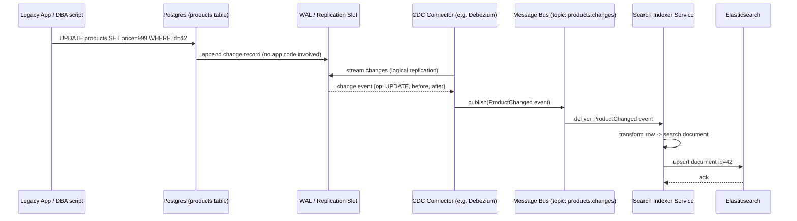
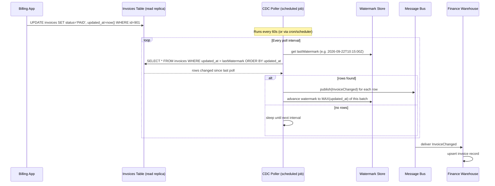

# Change Data Capture (CDC)

> Note: this pattern shares its async-delivery philosophy with the Transactional Outbox pattern — durably capture a change first, propagate it asynchronously and idempotently second, never make cross-system consistency depend on one synchronous call succeeding.


## What it is

CDC means: **instead of application code explicitly publishing events, you tap into the database's own transaction log (WAL / binlog / oplog) and turn every row-level insert/update/delete into a stream of change events**, automatically, with zero changes to the writing application.

Where the Outbox pattern requires you to *remember* to insert a row into an `outbox` table, CDC removes that requirement entirely — any write to any tracked table becomes an event, captured directly from the database engine's replication stream. Tools like **Debezium** (built on Kafka Connect), AWS DMS, or Postgres logical replication slots do this by reading the write-ahead log, not by querying the table.

CDC and Outbox are often combined: you still write to an `outbox` table for *deliberately shaped* business events, but instead of a polling relay, a CDC connector tails that table's WAL entries and streams them out — lower latency, no polling overhead, and the relay can't fall behind under load the way a poller can.

## Real-life example

**Legacy monolith → search index sync.** A retailer has a 15-year-old PostgreSQL-backed inventory system that many internal tools still write to directly (no API layer, no events — just raw SQL). The company wants a fast product search experience (Elasticsearch) without rewriting the legacy system or asking every internal tool to "please also call our new event API."

CDC solves this non-invasively: a Debezium connector attaches to Postgres's logical replication slot on the `products` table. Every `INSERT`/`UPDATE`/`DELETE`, from *any* source (the legacy app, a DBA's manual fix, a batch import script), flows into a Kafka topic as a structured change event. A downstream consumer updates Elasticsearch. The legacy system is never touched, never even aware this is happening.

## Sequence diagram



Note there is no arrow from `App` to `Connector` or `Bus` — that's the whole point. The application never knows CDC exists.

## Node.js code

You don't hand-roll WAL parsing (use Debezium/AWS DMS/Postgres logical decoding plugins for that). What you *do* write is the consumer side: a generic `ChangeEventConsumer` that reacts to change events coming off the bus, decoupled from which CDC tool produced them.

```js
// ---------------------------------------------------------------------------
// Generic shape all CDC tools converge on (Debezium's envelope format, which
// most tools now imitate): { op, before, after, source: { table, ts_ms } }
// ---------------------------------------------------------------------------

// A minimal interface any bus subscription must satisfy — agnostic of Kafka
// Connect / RabbitMQ / SQS / etc. Just needs to deliver messages to a handler.
class ChangeEventSubscriber {
  /** @param {(event: object) => Promise<void>} handler */
  async subscribe(topic, handler) {
    throw new Error('subscribe() must be implemented by a concrete adapter');
  }
}

// ---------------------------------------------------------------------------
// Downstream consumer: keep Elasticsearch in sync with Postgres, driven
// purely by CDC events — no polling, no direct DB reads from this service.
// ---------------------------------------------------------------------------
class SearchIndexSyncService {
  /**
   * @param {ChangeEventSubscriber} subscriber
   * @param {import('@elastic/elasticsearch').Client} esClient
   */
  constructor(subscriber, esClient) {
    this.subscriber = subscriber;
    this.es = esClient;
  }

  async start() {
    await this.subscriber.subscribe('products.changes', this._handleChange.bind(this));
  }

  async _handleChange(event) {
    const { op, after, before, source } = event;
    const id = (after ?? before).id;

    switch (op) {
      case 'c': // create
      case 'u': // update
      case 'r': // snapshot/read (initial load)
        await this.es.index({
          index: 'products',
          id: String(id),
          document: this._toSearchDoc(after),
          // Use the DB's own commit timestamp to make writes idempotent /
          // out-of-order-safe: ES will ignore stale writes if you use
          // optimistic concurrency (version / seq_no) tied to source.ts_ms.
        });
        break;
      case 'd': // delete
        await this.es.delete({ index: 'products', id: String(id) }).catch((err) => {
          if (err.meta?.statusCode !== 404) throw err; // already gone: fine
        });
        break;
      default:
        console.warn('Unknown CDC op', op);
    }
  }

  _toSearchDoc(row) {
    return {
      name: row.name,
      priceCents: row.price_cents,
      inStock: row.stock_qty > 0,
      updatedAt: row.updated_at,
    };
  }
}

module.exports = { ChangeEventSubscriber, SearchIndexSyncService };
```

## Two approaches to CDC

CDC isn't one technique — it's two fundamentally different ways of detecting "what changed," each with different trade-offs. Everything above described **Approach A**. Here's the full picture.

### Approach A: Log-based CDC (tailing the transaction log)

Already covered above — reads the database engine's own write-ahead log (Postgres WAL, MySQL binlog, MongoDB oplog) via a connector like Debezium. This is the industry-preferred approach whenever it's available.

**Why it's preferred:**
- **Zero load on the source table.** You're reading a log the DB already writes for its own durability guarantees, not issuing extra `SELECT`s against production tables.
- **Captures every change**, including hard `DELETE`s (a plain polling query can't see a row that's gone — it just silently stops appearing).
- **Low latency** — often sub-second, since it streams continuously rather than waiting for a poll interval.
- **Preserves exact ordering** and intra-transaction grouping of changes.

**Why it's sometimes not an option:**
- Requires infrastructure access to enable logical replication / binlog row format, which managed/shared databases (some tiers of RDS, many SaaS databases, legacy systems you don't administer) may restrict or disallow.
- Needs a dedicated connector process (Debezium + Kafka Connect, or similar) — real operational infrastructure to run and monitor.
- Schema changes on the source table can require careful connector reconfiguration.

### Approach B: Query-based (polling) CDC

When log access isn't available — a managed database that blocks replication slots, a third-party system you only have read-query access to, or you want something simple with no extra infrastructure — you fall back to **periodically querying the table for rows that changed since the last check**, using a watermark column (`updated_at` or a monotonically increasing version/sequence number).

**Real-life example:** A SaaS billing platform exposes a read-only Postgres replica to customers for reporting, but explicitly disallows logical replication slots on it (common restriction to protect the primary). A finance team needs invoice data mirrored into their own warehouse nightly. Since log-based CDC is off the table, a polling job queries `SELECT * FROM invoices WHERE updated_at > $lastWatermark ORDER BY updated_at` every few minutes, publishes each row as a change event, and advances the watermark.

**The unavoidable limitation:** polling **cannot see hard deletes** — a deleted row simply vanishes from query results with no trace. Systems that use polling CDC almost always require **soft deletes** (a `deleted_at` column, treated as just another "update" the poller can detect) instead of real `DELETE` statements.

#### Sequence diagram — polling-based CDC



#### Code — polling-based CDC poller

```js
// ---------------------------------------------------------------------------
// Watermark store: durable, so the poller can resume after a crash/restart
// without re-scanning the whole table or missing rows.
// ---------------------------------------------------------------------------
/*
CREATE TABLE cdc_watermarks (
  source_name TEXT PRIMARY KEY,   -- e.g. 'invoices_poller'
  last_watermark TIMESTAMPTZ NOT NULL,
  last_seen_id UUID              -- tie-breaker for rows sharing the same updated_at
);
*/

class WatermarkStore {
  constructor(pool) { this.pool = pool; }

  async get(sourceName) {
    const { rows } = await this.pool.query(
      `SELECT last_watermark, last_seen_id FROM cdc_watermarks WHERE source_name = $1`,
      [sourceName]
    );
    return rows[0] ?? { last_watermark: new Date(0), last_seen_id: null };
  }

  async advance(sourceName, watermark, lastSeenId) {
    await this.pool.query(
      `INSERT INTO cdc_watermarks (source_name, last_watermark, last_seen_id)
       VALUES ($1, $2, $3)
       ON CONFLICT (source_name) DO UPDATE SET last_watermark = $2, last_seen_id = $3`,
      [sourceName, watermark, lastSeenId]
    );
  }
}

// ---------------------------------------------------------------------------
// Polling CDC job. Note the tie-breaker on (updated_at, id) — a naive
// "updated_at > watermark" query alone can silently skip rows that share
// the exact same timestamp as the last-seen row in a prior batch.
// ---------------------------------------------------------------------------
class PollingCdcJob {
  /**
   * @param {import('pg').Pool} sourcePool   read-only connection to source DB
   * @param {WatermarkStore} watermarkStore
   * @param {MessageBus} bus                 same generic interface as before
   * @param {{ sourceName: string, table: string, topic: string, intervalMs?: number, batchSize?: number }} opts
   */
  constructor(sourcePool, watermarkStore, bus, opts) {
    this.sourcePool = sourcePool;
    this.watermarkStore = watermarkStore;
    this.bus = bus;
    this.opts = { intervalMs: 60_000, batchSize: 500, ...opts };
    this._running = false;
  }

  start() {
    this._running = true;
    this._loop();
  }

  stop() {
    this._running = false;
  }

  async _loop() {
    while (this._running) {
      try {
        await this._pollOnce();
      } catch (err) {
        console.error(`Polling CDC error (${this.opts.sourceName}):`, err);
      }
      await new Promise((r) => setTimeout(r, this.opts.intervalMs));
    }
  }

  async _pollOnce() {
    const { last_watermark, last_seen_id } = await this.watermarkStore.get(this.opts.sourceName);

    // (updated_at, id) compound comparison avoids missing/duplicating rows
    // that share a timestamp at the polling boundary.
    const { rows } = await this.sourcePool.query(
      `SELECT * FROM ${this.opts.table}
       WHERE (updated_at, id) > ($1, $2)
       ORDER BY updated_at ASC, id ASC
       LIMIT $3`,
      [last_watermark, last_seen_id ?? '00000000-0000-0000-0000-000000000000', this.opts.batchSize]
    );

    if (rows.length === 0) return;

    for (const row of rows) {
      await this.bus.publish(this.opts.topic, {
        type: row.deleted_at ? 'SoftDeleted' : 'Upserted', // real deletes are invisible to polling!
        payload: row,
      });
    }

    const last = rows[rows.length - 1];
    await this.watermarkStore.advance(this.opts.sourceName, last.updated_at, last.id);
  }
}

module.exports = { WatermarkStore, PollingCdcJob };
```

### Comparing the two approaches

| | Log-based CDC | Polling (query-based) CDC |
|---|---|---|
| Source DB load | Near zero (reads log, not table) | Extra `SELECT` load every interval |
| Latency | Sub-second typical | Bound by poll interval (seconds–minutes) |
| Captures hard deletes | Yes | No — requires soft deletes |
| Infra required | Log access + connector (e.g. Debezium/Kafka Connect) | None beyond a scheduled job + watermark table |
| Best for | Systems you administer, need low latency/completeness | Restricted/managed DBs, simple needs, no extra infra |

## Async flow strategy

- Whichever approach is used, the delivery mechanism (connector or poller) is the "relay," analogous to the Outbox relay — it guarantees **at-least-once** delivery by tracking a durable position (WAL offset, or a watermark row) and resuming from there after a crash.
- Consumers (like `SearchIndexSyncService` or the finance warehouse loader) must be **idempotent**, same as with Outbox — a row can be re-delivered after a connector/poller restart.
- CDC is a *superset* capability of Outbox: Outbox is "manually curated CDC on one table," while full-table CDC captures everything, including changes you didn't explicitly plan to publish. Many teams start with Outbox for a handful of business events and adopt full CDC later for broader sync/audit/replication needs.

---

