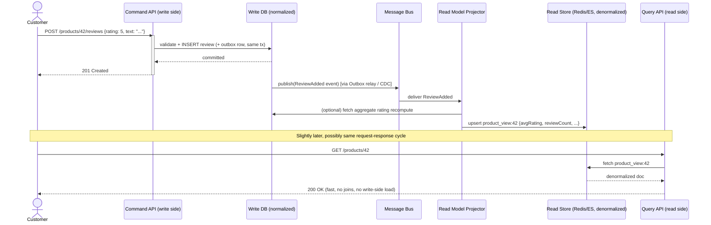
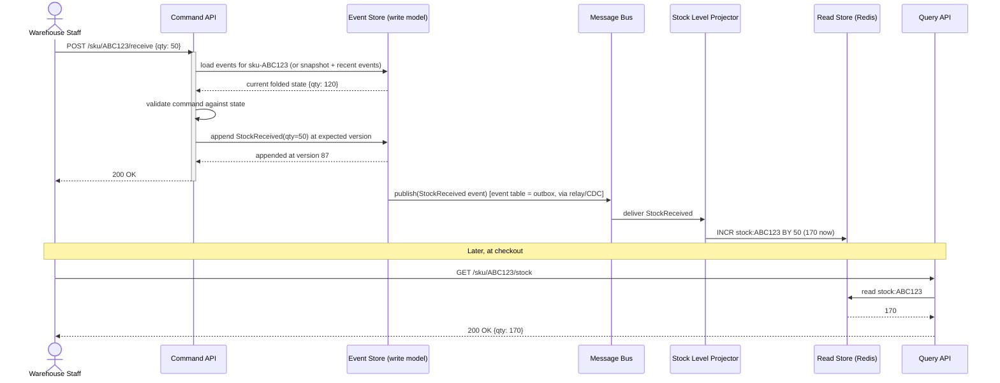

# CQRS (Command Query Responsibility Segregation)

> Note: this pattern shares its async-delivery philosophy with the Transactional Outbox, CDC, and Event Sourcing patterns — the read model is kept in sync asynchronously and idempotently, never synchronously coupled to the write path.


## What it is

CQRS splits a system into two distinct models:

- The **write model (command side)**: optimized for validating business rules and safely mutating state. Often normalized, often event-sourced (as above), often slower to query but strict about correctness.
- The **read model (query side)**: one or more denormalized, pre-computed views optimized purely for fast reads — no business logic, no validation, just "give me data shaped exactly how the UI/API needs it."

Crucially, these two models **do not share a database or schema**, and are kept in sync **asynchronously**, usually via the exact same Outbox/CDC/event-stream mechanisms already described. The read side is always slightly behind the write side (eventual consistency) — that lag is the price paid for read models that can be arbitrarily optimized (denormalized, cached, indexed differently, even stored in a different database engine like Elasticsearch or Redis) without ever touching write-side logic.

## Real-life example

**E-commerce product catalog with reviews and ratings.** The write side is a normalized relational schema: `products`, `reviews`, `inventory` tables, each updated by their own service, under strict validation (can't review a product you didn't buy, can't oversell inventory).

But the **product page** needs one fast read: product details + average rating + review count + current stock status, in a single call, at high traffic (Black Friday levels). Querying three normalized tables with joins/aggregations per page view doesn't scale. So a **read model** — a single denormalized `product_view` document in Redis/Elasticsearch — is maintained, updated asynchronously whenever an underlying write happens (`ReviewAdded`, `PriceChanged`, `StockUpdated`), and the product page reads only from that.

## Sequence diagram



The key asynchronous seam is the `Bus` step — exactly the same relay/CDC mechanism from the earlier patterns feeds the projector.

## Node.js code

```js
// ---------------------------------------------------------------------------
// Command side: validates and writes to the normalized write DB.
// Reuses the Outbox pattern from before for the write -> event handoff.
// ---------------------------------------------------------------------------
class AddReviewCommandHandler {
  constructor(pool) {
    this.pool = pool;
  }

  async handle({ productId, userId, rating, text }) {
    if (rating < 1 || rating > 5) throw new Error('Rating must be 1-5');

    const client = await this.pool.connect();
    try {
      await client.query('BEGIN');

      const purchased = await client.query(
        `SELECT 1 FROM orders WHERE product_id = $1 AND customer_id = $2 LIMIT 1`,
        [productId, userId]
      );
      if (purchased.rowCount === 0) throw new Error('Must purchase before reviewing');

      const reviewId = require('crypto').randomUUID();
      await client.query(
        `INSERT INTO reviews (id, product_id, user_id, rating, text) VALUES ($1,$2,$3,$4,$5)`,
        [reviewId, productId, userId, rating, text]
      );

      await client.query(
        `INSERT INTO outbox (id, event_type, payload, status)
         VALUES ($1, 'ReviewAdded', $2, 'PENDING')`,
        [require('crypto').randomUUID(), { reviewId, productId, userId, rating, text }]
      );

      await client.query('COMMIT');
      return reviewId;
    } catch (err) {
      await client.query('ROLLBACK');
      throw err;
    } finally {
      client.release();
    }
  }
}

// ---------------------------------------------------------------------------
// Read-side projector: consumes events, maintains a fast denormalized view.
// Runs completely independently of the write path.
// ---------------------------------------------------------------------------
class ProductViewProjector {
  /**
   * @param {ChangeEventSubscriber} subscriber   // same interface as the CDC example
   * @param {import('pg').Pool} writePool         // read-only queries against write DB, for aggregation
   * @param {import('ioredis').Redis} redis
   */
  constructor(subscriber, writePool, redis) {
    this.subscriber = subscriber;
    this.writePool = writePool;
    this.redis = redis;
  }

  async start() {
    await this.subscriber.subscribe('ReviewAdded', this._onReviewAdded.bind(this));
    await this.subscriber.subscribe('PriceChanged', this._onPriceChanged.bind(this));
    await this.subscriber.subscribe('StockUpdated', this._onStockUpdated.bind(this));
  }

  async _onReviewAdded(event) {
    const { productId } = event.payload;
    const { rows } = await this.writePool.query(
      `SELECT AVG(rating)::numeric(2,1) AS avg_rating, COUNT(*) AS review_count
       FROM reviews WHERE product_id = $1`,
      [productId]
    );
    await this._mergeView(productId, {
      avgRating: Number(rows[0].avg_rating),
      reviewCount: Number(rows[0].review_count),
    });
  }

  async _onPriceChanged(event) {
    await this._mergeView(event.payload.productId, { priceCents: event.payload.priceCents });
  }

  async _onStockUpdated(event) {
    await this._mergeView(event.payload.productId, { inStock: event.payload.qty > 0 });
  }

  async _mergeView(productId, partial) {
    const key = `product_view:${productId}`;
    const existing = JSON.parse((await this.redis.get(key)) ?? '{}');
    await this.redis.set(key, JSON.stringify({ ...existing, ...partial, productId }));
  }
}

// ---------------------------------------------------------------------------
// Query side: reads ONLY from the fast store, never touches the write DB.
// ---------------------------------------------------------------------------
class ProductQueryService {
  constructor(redis) {
    this.redis = redis;
  }

  async getProductView(productId) {
    const raw = await this.redis.get(`product_view:${productId}`);
    if (!raw) throw new Error('Not found (or projection not caught up yet)');
    return JSON.parse(raw);
  }
}

module.exports = { AddReviewCommandHandler, ProductViewProjector, ProductQueryService };
```

## Two approaches to the write side

### Approach A: CQRS over a normalized CRUD write model (already shown above)

The write side is an ordinary normalized relational schema (`products`, `reviews`, `inventory`). This is the more common, lower-complexity starting point: you get the read/write split and its scaling benefits without also adopting Event Sourcing. Most teams should start here.

### Approach B: CQRS with an Event-Sourced write model

Here the write side has **no normalized "current state" table at all** — the write model *is* an event store (exactly the `EventStore`/`Account` pattern from the Event Sourcing document), and every read model, including ones that look like "just the current row," is a **projection** built purely by consuming that event stream. This combo is extremely common in domains where the audit trail itself is a first-class requirement (finance, inventory/warehouse systems, anything with regulatory history requirements), because you get Event Sourcing's full history *and* CQRS's fast, purpose-built reads in one architecture.

**Real-life example:** A warehouse inventory system needs (a) a fully auditable history of every stock movement for compliance ("prove exactly when and why this SKU's count changed"), and (b) a sub-100ms "current stock level" read for the storefront during checkout. Event Sourcing gives you (a) for free — the event log *is* the audit trail, no separate audit table to keep in sync. CQRS gives you (b) by projecting that same event stream into a fast key-value read store, instead of ever running `SELECT SUM(...)` over the raw event log on the request path.

#### Sequence diagram — event-sourced CQRS



#### Code — event-sourced write model feeding a CQRS read model

```js
// ---------------------------------------------------------------------------
// Write side: reuses EventStore from the Event Sourcing document verbatim.
// The "aggregate" here is StockItem instead of Account, same shape.
// ---------------------------------------------------------------------------
class StockItem {
  static fold(events) {
    const state = { qty: 0, exists: false };
    for (const { type, payload } of events) {
      switch (type) {
        case 'StockItemCreated': state.exists = true; break;
        case 'StockReceived': state.qty += payload.qty; break;
        case 'StockShipped': state.qty -= payload.qty; break;
      }
    }
    return state;
  }

  static decideReceive(state, qty) {
    if (!state.exists) throw new Error('SKU does not exist');
    if (qty <= 0) throw new Error('Quantity must be positive');
    return [{ type: 'StockReceived', payload: { qty } }];
  }

  static decideShip(state, qty) {
    if (qty > state.qty) throw new Error('Cannot ship more than on hand');
    return [{ type: 'StockShipped', payload: { qty } }];
  }
}

class ReceiveStockCommandHandler {
  constructor(eventStore) { this.store = eventStore; } // same EventStore class as Event Sourcing doc

  async handle(sku, qty) {
    const streamId = `sku-${sku}`;
    const events = await this.store.load(streamId);
    const state = StockItem.fold(events);
    const newEvents = StockItem.decideReceive(state, qty);
    return this.store.append(streamId, newEvents, events.length - 1);
  }
}

// ---------------------------------------------------------------------------
// Read side: a projector that turns the event stream into O(1) stock
// lookups — the read model has literally no concept of "events," just a
// running integer per SKU, updated incrementally as events arrive.
// ---------------------------------------------------------------------------
class StockLevelProjector {
  /**
   * @param {ChangeEventSubscriber} subscriber   // fed by the event table's outbox/CDC relay
   * @param {import('ioredis').Redis} redis
   */
  constructor(subscriber, redis) {
    this.subscriber = subscriber;
    this.redis = redis;
  }

  async start() {
    await this.subscriber.subscribe('StockReceived', (evt) =>
      this.redis.incrby(`stock:${this._sku(evt)}`, evt.payload.qty)
    );
    await this.subscriber.subscribe('StockShipped', (evt) =>
      this.redis.decrby(`stock:${this._sku(evt)}`, evt.payload.qty)
    );
  }

  _sku(evt) {
    return evt.aggregateId.replace('sku-', '');
  }
}

// ---------------------------------------------------------------------------
// Query side: pure read, no knowledge of the event store's existence.
// ---------------------------------------------------------------------------
class StockQueryService {
  constructor(redis) { this.redis = redis; }

  async getStockLevel(sku) {
    const qty = await this.redis.get(`stock:${sku}`);
    return qty === null ? 0 : Number(qty);
  }
}

module.exports = { StockItem, ReceiveStockCommandHandler, StockLevelProjector, StockQueryService };
```

Notice `StockLevelProjector` uses **incremental** `INCR`/`DECR` rather than re-summing all events on every update — because the write side is event-sourced, the read side can be built as a running total that only ever processes *new* events, never replays history. That's the real payoff of combining these two patterns.

### Comparing the two approaches

| | CQRS over CRUD write model | CQRS with Event-Sourced write model |
|---|---|---|
| Write-side complexity | Lower — ordinary tables, familiar ORMs | Higher — event store, aggregate folding, concurrency handling |
| Audit trail | Needs a separate audit log if required | Free — the event log *is* the audit trail |
| Rebuilding read models from scratch | Requires re-reading current-state tables | Requires replaying the full event stream (more work, but always possible and exact) |
| When to use | Most systems; read/write scaling is the only goal | Compliance-heavy domains, or when Event Sourcing is already in use for other reasons |

## Async flow strategy

Identical shape to Outbox → CDC in both approaches: the write side commits business data (± an outbox row, or the event itself in the event-sourced case) atomically; a relay/CDC tails it onto the bus; a projector (a pure consumer) rebuilds one or more read models. CQRS's only addition on top of Outbox/CDC is the **explicit split of the API surface** into commands (mutate, validated, hits write side) vs queries (read-only, hits read store) — often literally two separate deployable services scaled independently, since read traffic and write traffic have very different load profiles.

---

