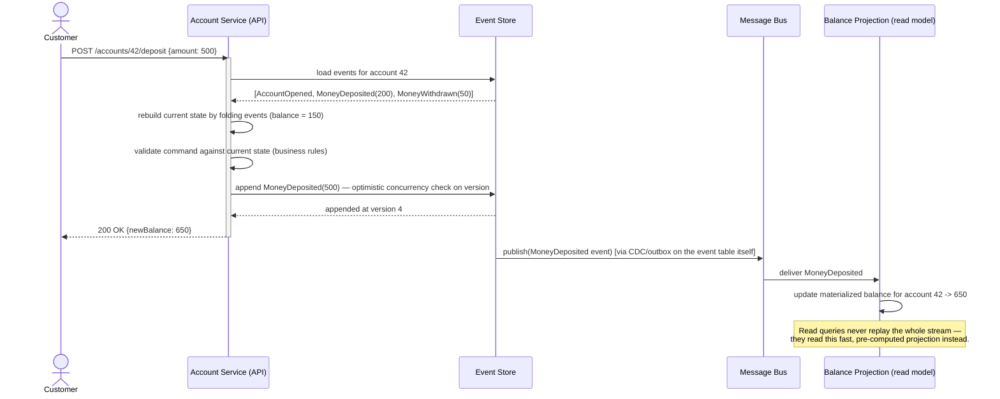
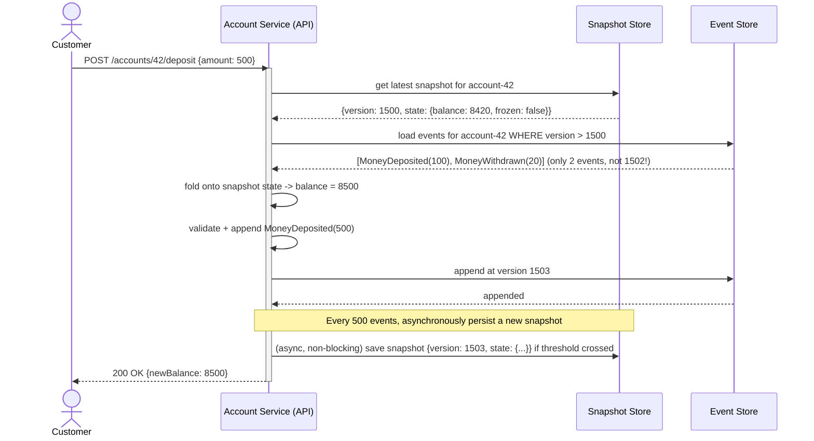

# Event Sourcing

> Note: this pattern shares its async-delivery philosophy with the Transactional Outbox and CDC patterns — durably capture a change first, propagate it asynchronously and idempotently second.


## What it is

Instead of storing only the **current state** of an entity (a row that gets overwritten on every update), Event Sourcing stores the **full sequence of events** that led to that state. The current state is never persisted directly — it's *derived* by replaying events. The event log is the single source of truth; everything else (including your normal-looking "current state" table) is a cache that can be rebuilt from scratch at any time.

This is a fundamentally different mental model from CRUD: you don't `UPDATE accounts SET balance = 500`, you `INSERT INTO events (type='MoneyDeposited', amount=500)` and balance becomes "the sum of all deposit/withdrawal events for this account."

## Real-life example

**Bank account ledger.** Banks have used this pattern for centuries, just on paper: a ledger of debits and credits, not a single mutable "current balance" field. Digitally:

- Every action (`AccountOpened`, `MoneyDeposited`, `MoneyWithdrawn`, `AccountFrozen`) is appended as an immutable event to that account's event stream.
- The current balance is calculated by folding over the stream.
- **Auditability is free**: "why is this balance what it is" is answered by literally showing every event, not just the final number — critical for compliance, dispute resolution, and fraud investigation.
- **Time travel is free**: "what was the balance on March 3rd" = replay events up to that date.
- If a bug in the balance-calculation logic is found and fixed, you can **replay all events** from day one with the corrected logic and get a corrected balance — something you fundamentally cannot do with mutable state (the old, buggy balance overwrote the truth already).

## Sequence diagram



Notice the event store publishing to the bus is itself just an **Outbox/CDC pattern applied to the event table** — the event table *is* the outbox. This is why these patterns compose so naturally.

## Node.js code

```js
// ---------------------------------------------------------------------------
// Event store: append-only, optimistic concurrency via expected version
// ---------------------------------------------------------------------------
class ConcurrencyError extends Error {}

class EventStore {
  /** @param {import('pg').Pool} pool */
  constructor(pool) {
    this.pool = pool;
  }

  /**
   * @param {string} streamId  e.g. "account-42"
   * @param {{type: string, payload: object}[]} events
   * @param {number} expectedVersion  version this client last read; -1 for new stream
   */
  async append(streamId, events, expectedVersion) {
    const client = await this.pool.connect();
    try {
      await client.query('BEGIN');

      const { rows } = await client.query(
        `SELECT COALESCE(MAX(version), -1) AS version FROM events WHERE stream_id = $1`,
        [streamId]
      );
      const currentVersion = rows[0].version;

      if (currentVersion !== expectedVersion) {
        throw new ConcurrencyError(
          `Expected version ${expectedVersion} but stream is at ${currentVersion}`
        );
      }

      let version = currentVersion;
      for (const evt of events) {
        version += 1;
        await client.query(
          `INSERT INTO events (stream_id, version, type, payload, occurred_at)
           VALUES ($1, $2, $3, $4, now())`,
          [streamId, version, evt.type, evt.payload]
        );
      }

      await client.query('COMMIT');
      return version;
    } catch (err) {
      await client.query('ROLLBACK');
      throw err;
    } finally {
      client.release();
    }
  }

  async load(streamId) {
    const { rows } = await this.pool.query(
      `SELECT version, type, payload FROM events WHERE stream_id = $1 ORDER BY version ASC`,
      [streamId]
    );
    return rows;
  }
}

// ---------------------------------------------------------------------------
// Aggregate: rebuild current state by folding events; produce new events
// from commands after validating business rules against that state.
// ---------------------------------------------------------------------------
class Account {
  static fold(events) {
    const state = { balance: 0, frozen: false, exists: false };
    for (const { type, payload } of events) {
      switch (type) {
        case 'AccountOpened': state.exists = true; break;
        case 'MoneyDeposited': state.balance += payload.amount; break;
        case 'MoneyWithdrawn': state.balance -= payload.amount; break;
        case 'AccountFrozen': state.frozen = true; break;
      }
    }
    return state;
  }

  static decideDeposit(state, amount) {
    if (!state.exists) throw new Error('Account does not exist');
    if (state.frozen) throw new Error('Account is frozen');
    if (amount <= 0) throw new Error('Deposit amount must be positive');
    return [{ type: 'MoneyDeposited', payload: { amount } }];
  }

  static decideWithdraw(state, amount) {
    if (!state.exists) throw new Error('Account does not exist');
    if (state.frozen) throw new Error('Account is frozen');
    if (amount > state.balance) throw new Error('Insufficient funds');
    return [{ type: 'MoneyWithdrawn', payload: { amount } }];
  }
}

// ---------------------------------------------------------------------------
// Application service: load -> fold -> decide -> append (with retry on
// concurrency conflicts, since two concurrent commands may race)
// ---------------------------------------------------------------------------
class AccountService {
  constructor(eventStore) {
    this.store = eventStore;
  }

  async deposit(accountId, amount) {
    return this._retry(async () => {
      const streamId = `account-${accountId}`;
      const events = await this.store.load(streamId);
      const state = Account.fold(events);
      const newEvents = Account.decideDeposit(state, amount);
      const version = await this.store.append(streamId, newEvents, events.length - 1);
      return { newBalance: state.balance + amount, version };
    });
  }

  async _retry(fn, attempts = 3) {
    for (let i = 0; i < attempts; i++) {
      try {
        return await fn();
      } catch (err) {
        if (!(err instanceof ConcurrencyError) || i === attempts - 1) throw err;
        // someone else appended in the meantime — reload and try again
      }
    }
  }
}

module.exports = { EventStore, Account, AccountService, ConcurrencyError };
```

## Two approaches to loading state

### Approach A: Full replay (already shown above)

Every `load()` call fetches **every event ever recorded** for the stream and folds them from scratch. This is simple and always correct, but it does not scale forever: an account with 200,000 historical transactions means replaying 200,000 rows on every single deposit request — increasingly slow, and increasingly expensive in DB round-trip size.

### Approach B: Snapshotting

Periodically (every N events, or on a schedule), persist a **snapshot**: the already-folded state at a specific event version. Loading then becomes "fetch the latest snapshot, then replay only the events *after* that version" — turning an O(all history) load into an O(events since last snapshot) load, regardless of how old the stream is.

**Real-life example:** A high-frequency trading account or a long-lived loyalty-points account accumulates hundreds of thousands of events over years. Without snapshotting, loading that account's state for a routine balance check means replaying its entire history every time — noticeably slow, and wasteful, since 99.9% of those events are years old and never change. With snapshotting every 500 events, loading only ever replays at most 499 events on top of the nearest snapshot, no matter how many millions of events exist in total.

#### Sequence diagram — load with snapshotting



#### Code — snapshot store + snapshot-aware loading

```js
// ---------------------------------------------------------------------------
// Snapshot store: one row per stream, always overwritten with the latest.
// ---------------------------------------------------------------------------
/*
CREATE TABLE snapshots (
  stream_id TEXT PRIMARY KEY,
  version INT NOT NULL,
  state JSONB NOT NULL,
  created_at TIMESTAMPTZ DEFAULT now()
);
*/

class SnapshotStore {
  constructor(pool) { this.pool = pool; }

  async get(streamId) {
    const { rows } = await this.pool.query(
      `SELECT version, state FROM snapshots WHERE stream_id = $1`,
      [streamId]
    );
    return rows[0] ?? null; // null means "no snapshot yet, replay from the start"
  }

  async save(streamId, version, state) {
    await this.pool.query(
      `INSERT INTO snapshots (stream_id, version, state)
       VALUES ($1, $2, $3)
       ON CONFLICT (stream_id) DO UPDATE SET version = $2, state = $3, created_at = now()`,
      [streamId, version, state]
    );
  }
}

// ---------------------------------------------------------------------------
// EventStore gains a version-bounded load, so callers can fetch "events
// after version X" instead of always fetching everything.
// ---------------------------------------------------------------------------
class EventStoreWithSnapshots extends EventStore {
  async loadSince(streamId, sinceVersion) {
    const { rows } = await this.pool.query(
      `SELECT version, type, payload FROM events
       WHERE stream_id = $1 AND version > $2
       ORDER BY version ASC`,
      [streamId, sinceVersion]
    );
    return rows;
  }
}

// ---------------------------------------------------------------------------
// Application service: snapshot-aware load, with periodic snapshot writes.
// ---------------------------------------------------------------------------
class SnapshottingAccountService {
  /**
   * @param {EventStoreWithSnapshots} eventStore
   * @param {SnapshotStore} snapshotStore
   * @param {number} snapshotEvery  e.g. 500 — write a new snapshot every N events
   */
  constructor(eventStore, snapshotStore, snapshotEvery = 500) {
    this.store = eventStore;
    this.snapshots = snapshotStore;
    this.snapshotEvery = snapshotEvery;
  }

  async _loadState(streamId) {
    const snapshot = await this.snapshots.get(streamId);
    const baseState = snapshot ? snapshot.state : { balance: 0, frozen: false, exists: false };
    const baseVersion = snapshot ? snapshot.version : -1;

    const eventsSince = snapshot
      ? await this.store.loadSince(streamId, baseVersion)
      : await this.store.load(streamId);

    // fold only the events since the snapshot onto the snapshot's state,
    // instead of Account.fold(allEventsEverRecorded)
    let state = { ...baseState };
    for (const { type, payload } of eventsSince) {
      switch (type) {
        case 'AccountOpened': state.exists = true; break;
        case 'MoneyDeposited': state.balance += payload.amount; break;
        case 'MoneyWithdrawn': state.balance -= payload.amount; break;
        case 'AccountFrozen': state.frozen = true; break;
      }
    }

    const currentVersion = baseVersion + eventsSince.length;
    return { state, currentVersion };
  }

  async deposit(accountId, amount) {
    const streamId = `account-${accountId}`;
    const { state, currentVersion } = await this._loadState(streamId);

    const newEvents = Account.decideDeposit(state, amount);
    const newVersion = await this.store.append(streamId, newEvents, currentVersion);

    // Snapshot maintenance is deliberately async/best-effort: if it fails or
    // is delayed, correctness is unaffected — the next load just replays a
    // few more events than ideal. Never let snapshot writes block the
    // business transaction or be part of its atomicity guarantee.
    if (newVersion % this.snapshotEvery === 0) {
      const newState = { ...state, balance: state.balance + amount };
      this.snapshots.save(streamId, newVersion, newState).catch((err) =>
        console.error('Snapshot write failed (non-fatal):', err)
      );
    }

    return { newBalance: state.balance + amount, version: newVersion };
  }
}

module.exports = { SnapshotStore, EventStoreWithSnapshots, SnapshottingAccountService };
```

**Important correctness note:** the snapshot is purely a **performance optimization**, never a source of truth. The event log remains authoritative — if a snapshot is ever lost or corrupted, the system must still be able to rebuild correct state by replaying from event version 0. This is also why snapshot writes are async/best-effort and never part of the same transaction as the event append: a failed snapshot write should never fail the business operation.

### Comparing the two approaches

| | Full replay | Snapshotting |
|---|---|---|
| Load complexity | O(all events in stream) | O(events since last snapshot) |
| Implementation complexity | Simple | Extra store + invalidation/versioning logic |
| Correctness risk | None — always the ground truth | None, *if* snapshots stay purely derived/optional |
| When to use | Streams that stay small (bounded lifecycle, e.g. one order) | Long-lived, high-volume streams (accounts, long-running processes) |

## Async flow strategy

The `events` table above is published downstream **exactly like an Outbox table** — either a polling relay or CDC tailing the table's WAL (see the CDC document's two approaches — both apply here unchanged). This is what feeds the read-side **projections** (like the balance projection in the diagram), which is precisely how Event Sourcing pairs with CQRS, covered next.

---

