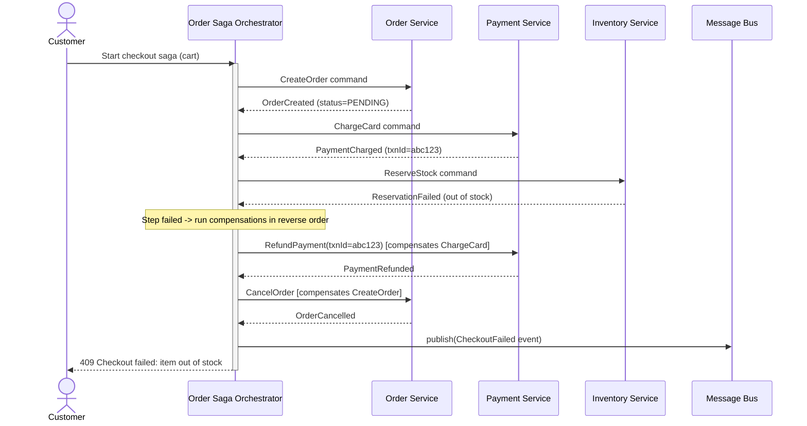
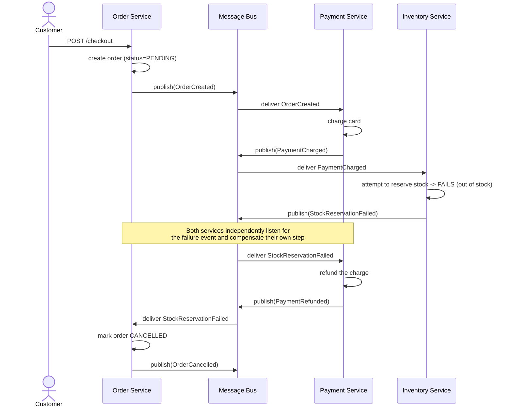

# Saga Pattern

> Note: this pattern shares its async-delivery philosophy with the Transactional Outbox, CDC, Event Sourcing, and CQRS patterns — every cross-service step is command in / event out over an async bus, never a synchronous blocking call.


## What it is

A **Saga** manages a business transaction that spans **multiple services, each with its own database** — where a classic ACID transaction (single `BEGIN...COMMIT` across all of them) is impossible. Instead, the saga is a sequence of **local transactions**, each in one service, where every step that changes state has a matching **compensating transaction** that undoes it if a later step fails. There's no rollback in the database sense — only forward-moving compensating actions that semantically reverse earlier ones (e.g. "refund the payment" compensates "charge the payment"; a `DELETE` never actually happens).

Two implementation styles:

- **Choreography**: each service listens for events from others and reacts, with no central coordinator. Simple for a few steps, but the overall flow becomes implicit — spread across every service's event handlers — and hard to see/debug as steps grow.
- **Orchestration**: a dedicated **Saga Orchestrator** explicitly calls each step and issues compensations on failure. The flow is centralized, visible in one place, easier to reason about and monitor — at the cost of the orchestrator becoming a critical piece of infrastructure (though it should be stateless-restartable, driven by persisted saga state, not held in memory).

## Real-life example

**E-commerce checkout across independent services**: Order Service, Payment Service, Inventory Service, Shipping Service — each owns its own database, each deployed and scaled independently.

Placing an order requires, in sequence:
1. Order Service: create order (status `PENDING`)
2. Payment Service: charge the customer's card
3. Inventory Service: reserve stock
4. Shipping Service: schedule a shipment
5. Order Service: mark order `CONFIRMED`

If step 3 fails (item just went out of stock), steps 1-2 must be **compensated**: refund the payment (compensates step 2), cancel the order (compensates step 1). The customer should never end up charged for an order that can't ship.

## Sequence diagram (orchestration-based, with a failure + compensation)



Each orchestrator→service call above (`ChargeCard`, `ReserveStock`, etc.) is itself typically an **async command over the bus**, not a synchronous HTTP call — the orchestrator publishes a command, the service processes it and publishes a reply event, and the orchestrator's own state machine advances on receiving that event. This makes each step independently retryable and keeps services decoupled, same as every pattern above.

## Node.js code (orchestration-based saga)

```js
// ---------------------------------------------------------------------------
// Saga state persisted in its own table — the orchestrator must be able to
// crash and resume mid-saga without losing track of what's been done.
// ---------------------------------------------------------------------------
/*
CREATE TABLE saga_instances (
  id UUID PRIMARY KEY,
  saga_type TEXT NOT NULL,
  current_step TEXT NOT NULL,
  status TEXT NOT NULL,        -- RUNNING | COMPLETED | COMPENSATING | FAILED
  payload JSONB NOT NULL,
  completed_steps JSONB NOT NULL DEFAULT '[]',
  updated_at TIMESTAMPTZ DEFAULT now()
);
*/

// Each step declares: how to execute it, and how to compensate it.
// action/compensate return a command to publish; the orchestrator advances
// only when the corresponding reply event arrives (async, at-least-once).
const CHECKOUT_SAGA_DEFINITION = [
  {
    name: 'CreateOrder',
    command: (ctx) => ({ topic: 'order.commands', type: 'CreateOrder', payload: { cartId: ctx.cartId } }),
    successEvent: 'OrderCreated',
    compensate: (ctx) => ({ topic: 'order.commands', type: 'CancelOrder', payload: { orderId: ctx.orderId } }),
  },
  {
    name: 'ChargeCard',
    command: (ctx) => ({ topic: 'payment.commands', type: 'ChargeCard', payload: { orderId: ctx.orderId, amount: ctx.amount } }),
    successEvent: 'PaymentCharged',
    compensate: (ctx) => ({ topic: 'payment.commands', type: 'RefundPayment', payload: { txnId: ctx.txnId } }),
  },
  {
    name: 'ReserveStock',
    command: (ctx) => ({ topic: 'inventory.commands', type: 'ReserveStock', payload: { orderId: ctx.orderId, items: ctx.items } }),
    successEvent: 'StockReserved',
    compensate: (ctx) => ({ topic: 'inventory.commands', type: 'ReleaseStock', payload: { orderId: ctx.orderId } }),
  },
  {
    name: 'ScheduleShipment',
    command: (ctx) => ({ topic: 'shipping.commands', type: 'ScheduleShipment', payload: { orderId: ctx.orderId } }),
    successEvent: 'ShipmentScheduled',
    compensate: (ctx) => ({ topic: 'shipping.commands', type: 'CancelShipment', payload: { orderId: ctx.orderId } }),
  },
];

class CheckoutSagaOrchestrator {
  /**
   * @param {import('pg').Pool} pool
   * @param {MessageBus} bus            // same generic interface as Outbox
   * @param {ChangeEventSubscriber} subscriber
   */
  constructor(pool, bus, subscriber) {
    this.pool = pool;
    this.bus = bus;
    this.subscriber = subscriber;
  }

  async start() {
    // listen for every possible reply/failure event across all steps
    for (const step of CHECKOUT_SAGA_DEFINITION) {
      await this.subscriber.subscribe(step.successEvent, (evt) => this._onStepSucceeded(step.name, evt));
      await this.subscriber.subscribe(`${step.name}Failed`, (evt) => this._onStepFailed(step.name, evt));
    }
  }

  async beginCheckout(cartId, amount, items) {
    const sagaId = require('crypto').randomUUID();
    const context = { sagaId, cartId, amount, items };
    await this.pool.query(
      `INSERT INTO saga_instances (id, saga_type, current_step, status, payload, completed_steps)
       VALUES ($1, 'Checkout', $2, 'RUNNING', $3, '[]')`,
      [sagaId, CHECKOUT_SAGA_DEFINITION[0].name, context]
    );
    await this._executeStep(sagaId, 0, context);
    return sagaId;
  }

  async _executeStep(sagaId, stepIndex, context) {
    const step = CHECKOUT_SAGA_DEFINITION[stepIndex];
    const cmd = step.command(context);
    await this.bus.publish(cmd.topic, { sagaId, type: cmd.type, payload: cmd.payload });
  }

  async _onStepSucceeded(stepName, event) {
    const { rows } = await this.pool.query(`SELECT * FROM saga_instances WHERE id = $1`, [event.sagaId]);
    const saga = rows[0];
    if (!saga || saga.status !== 'RUNNING') return; // stale/duplicate event, ignore

    const context = { ...saga.payload, ...event.payload }; // merge new data (e.g. orderId, txnId)
    const stepIndex = CHECKOUT_SAGA_DEFINITION.findIndex((s) => s.name === stepName);
    const completedSteps = [...saga.completed_steps, stepName];
    const nextIndex = stepIndex + 1;

    if (nextIndex >= CHECKOUT_SAGA_DEFINITION.length) {
      await this.pool.query(
        `UPDATE saga_instances SET status='COMPLETED', payload=$2, completed_steps=$3 WHERE id=$1`,
        [saga.id, context, completedSteps]
      );
      await this.bus.publish('checkout.events', { type: 'CheckoutCompleted', payload: context });
      return;
    }

    await this.pool.query(
      `UPDATE saga_instances SET current_step=$2, payload=$3, completed_steps=$4 WHERE id=$1`,
      [saga.id, CHECKOUT_SAGA_DEFINITION[nextIndex].name, context, completedSteps]
    );
    await this._executeStep(saga.id, nextIndex, context);
  }

  async _onStepFailed(stepName, event) {
    const { rows } = await this.pool.query(`SELECT * FROM saga_instances WHERE id = $1`, [event.sagaId]);
    const saga = rows[0];
    if (!saga || saga.status !== 'RUNNING') return;

    await this.pool.query(`UPDATE saga_instances SET status='COMPENSATING' WHERE id=$1`, [saga.id]);

    // walk completed steps in reverse, firing each one's compensation
    for (const doneStepName of [...saga.completed_steps].reverse()) {
      const step = CHECKOUT_SAGA_DEFINITION.find((s) => s.name === doneStepName);
      const compCmd = step.compensate(saga.payload);
      await this.bus.publish(compCmd.topic, { sagaId: saga.id, type: compCmd.type, payload: compCmd.payload });
      // in production: wait for each compensation's own ack event before
      // proceeding to the next, and persist progress after each one, so a
      // crash mid-compensation resumes correctly rather than re-running or
      // skipping steps.
    }

    await this.pool.query(`UPDATE saga_instances SET status='FAILED' WHERE id=$1`, [saga.id]);
    await this.bus.publish('checkout.events', { type: 'CheckoutFailed', payload: { sagaId: saga.id, failedStep: stepName } });
  }
}

module.exports = { CheckoutSagaOrchestrator, CHECKOUT_SAGA_DEFINITION };
```

## Two approaches: Orchestration vs Choreography

Everything above described **orchestration**: a central coordinator explicitly drives every step. Here's the second approach in full.

### Approach A: Orchestration (already shown above)

A single `CheckoutSagaOrchestrator` owns the sequencing logic and persisted saga state, explicitly issuing each command and reacting to each reply. The flow is visible in one place, which makes it far easier to understand, monitor, and debug as the number of steps grows — at the cost of that orchestrator being a piece of shared infrastructure every step depends on.

### Approach B: Choreography

There is no central coordinator. Instead, **each service listens for the events that matter to it and reacts independently** — including reacting to failure events to trigger its own compensating action. The "saga" only exists conceptually, as the emergent result of every service's individual event handlers; no single place in the code describes the whole flow end to end.

**Real-life example:** A smaller team running the same checkout flow (Order → Payment → Inventory → Shipping) but with only 3-4 steps total decides an orchestrator is more infrastructure than the flow's complexity warrants. Instead, each service is responsible only for reacting to the previous step's success event and either emitting its own success event or a failure event — and, symmetrically, reacting to a downstream failure event by compensating its own earlier action. This keeps each service simpler and fully independent (no shared orchestrator to deploy/scale/monitor), at the cost of the overall checkout flow being implicit — you have to read four services' event handlers to reconstruct "what happens when Inventory fails," rather than reading one orchestrator's step list.

#### Sequence diagram — choreography-based saga (with a failure + cascading compensation)



Note how **no single participant knows the whole flow** — `PaySvc` only knows "on `OrderCreated`, charge; on `StockReservationFailed`, refund." `InvSvc` only knows "on `PaymentCharged`, reserve; on failure, publish a failure event." The end-to-end behavior emerges from these independent, local reactions.

#### Code — choreography-based saga

```js
// ---------------------------------------------------------------------------
// Each service is a standalone, independently deployable unit. There is no
// shared "saga" class — every service only implements its own local
// transaction + its own compensation, wired to the events it cares about.
// ---------------------------------------------------------------------------

// ---- Order Service --------------------------------------------------------
class OrderServiceChoreography {
  /**
   * @param {import('pg').Pool} pool
   * @param {MessageBus} bus
   * @param {ChangeEventSubscriber} subscriber
   */
  constructor(pool, bus, subscriber) {
    this.pool = pool;
    this.bus = bus;
    this.subscriber = subscriber;
  }

  async start() {
    // Order Service only needs to react to a downstream failure to compensate
    // its own CreateOrder step. It doesn't know or care *which* step failed.
    await this.subscriber.subscribe('StockReservationFailed', this._onDownstreamFailure.bind(this));
    await this.subscriber.subscribe('PaymentFailed', this._onDownstreamFailure.bind(this));
  }

  async createOrder(cartId, customerId, amount) {
    const orderId = require('crypto').randomUUID();
    await this.pool.query(
      `INSERT INTO orders (id, cart_id, customer_id, amount, status) VALUES ($1,$2,$3,$4,'PENDING')`,
      [orderId, cartId, customerId, amount]
    );
    // Outbox-pattern publish, same as always: this event is what drives
    // the rest of the choreography, with no orchestrator involved.
    await this.bus.publish('order.events', { type: 'OrderCreated', payload: { orderId, customerId, amount } });
    return orderId;
  }

  async _onDownstreamFailure(event) {
    const { orderId } = event.payload;
    await this.pool.query(`UPDATE orders SET status = 'CANCELLED' WHERE id = $1`, [orderId]);
    await this.bus.publish('order.events', { type: 'OrderCancelled', payload: { orderId } });
  }
}

// ---- Payment Service -------------------------------------------------------
class PaymentServiceChoreography {
  constructor(pool, bus, subscriber, paymentGateway) {
    this.pool = pool;
    this.bus = bus;
    this.subscriber = subscriber;
    this.gateway = paymentGateway;
  }

  async start() {
    await this.subscriber.subscribe('OrderCreated', this._onOrderCreated.bind(this));
    // Compensation trigger: any failure event further down the chain
    await this.subscriber.subscribe('StockReservationFailed', this._onDownstreamFailure.bind(this));
  }

  async _onOrderCreated(event) {
    const { orderId, customerId, amount } = event.payload;
    try {
      const txnId = await this.gateway.charge(customerId, amount);
      await this.pool.query(
        `INSERT INTO payments (order_id, txn_id, amount, status) VALUES ($1,$2,$3,'CHARGED')`,
        [orderId, txnId, amount]
      );
      await this.bus.publish('payment.events', { type: 'PaymentCharged', payload: { orderId, txnId, amount } });
    } catch (err) {
      await this.bus.publish('payment.events', { type: 'PaymentFailed', payload: { orderId, reason: err.message } });
    }
  }

  async _onDownstreamFailure(event) {
    const { orderId } = event.payload;
    const { rows } = await this.pool.query(`SELECT txn_id FROM payments WHERE order_id = $1`, [orderId]);
    if (rows.length === 0) return; // nothing was charged, nothing to compensate

    await this.gateway.refund(rows[0].txn_id);
    await this.pool.query(`UPDATE payments SET status = 'REFUNDED' WHERE order_id = $1`, [orderId]);
    await this.bus.publish('payment.events', { type: 'PaymentRefunded', payload: { orderId } });
  }
}

// ---- Inventory Service ------------------------------------------------------
class InventoryServiceChoreography {
  constructor(pool, bus, subscriber) {
    this.pool = pool;
    this.bus = bus;
    this.subscriber = subscriber;
  }

  async start() {
    await this.subscriber.subscribe('PaymentCharged', this._onPaymentCharged.bind(this));
  }

  async _onPaymentCharged(event) {
    const { orderId, amount } = event.payload;
    const items = await this._itemsForOrder(orderId);

    const available = await this._checkStock(items);
    if (!available) {
      await this.bus.publish('inventory.events', { type: 'StockReservationFailed', payload: { orderId } });
      return;
    }

    await this._reserve(items);
    await this.bus.publish('inventory.events', { type: 'StockReserved', payload: { orderId, items } });
  }

  async _itemsForOrder(orderId) { /* fetch order line items */ return []; }
  async _checkStock(items) { /* check availability */ return true; }
  async _reserve(items) { /* decrement reserved quantities */ }
}

module.exports = { OrderServiceChoreography, PaymentServiceChoreography, InventoryServiceChoreography };
```

Every service above subscribes only to the specific event topics it needs — `PaymentServiceChoreography` doesn't know Inventory exists; it just knows "react to `OrderCreated`, and react to any failure event that means I should refund." This is what makes choreography attractive for small flows: each service is genuinely independent. It's also exactly why it gets harder to reason about as steps grow — tracing "what happens on checkout" means reading every service's subscriptions instead of one file.

### Comparing the two approaches

| | Orchestration | Choreography |
|---|---|---|
| Flow visibility | Centralized — one place shows the whole sequence | Implicit — spread across every service's event handlers |
| Coupling | Services depend on the orchestrator issuing commands | Services depend only on event contracts, not each other directly |
| Debugging a stuck saga | Inspect one `saga_instances` row | Trace events across multiple services' logs |
| Adding a new step | Add a step to the orchestrator's definition | Add subscriptions in the new service + update upstream/downstream services' event contracts |
| Best for | Longer/more complex flows (4+ steps), flows needing visibility/monitoring | Small flows (2-3 steps), teams wanting maximum service independence |
| New infrastructure required | Yes — the orchestrator itself (stateful, needs its own persistence) | No — just pub/sub on the existing bus |

## Async flow strategy

- In **both** approaches, every cross-service interaction is **command/event in, response/event out**, over the same bus abstraction — no service ever calls another synchronously, so a slow/down Inventory Service doesn't block Payment Service's own work.
- In orchestration, saga state is **persisted, not in-memory** (`saga_instances` table), so the orchestrator can crash and resume — read pending sagas on boot and continue from `current_step`. In choreography, each service's own local database is the only state that needs to survive a crash — there's no separate saga-tracking table, since there's no separate saga process.
- Every step handler must be **idempotent** (a command/event may be delivered twice) and every compensation must be **safe to run even if the original action partially failed** (e.g. "refund if charged, no-op if not") — this holds identically in both approaches.
- Both approaches publish through the same broker-agnostic `MessageBus`/`ChangeEventSubscriber` interfaces used throughout every pattern in this series — switching between orchestration and choreography is a matter of *where the sequencing logic lives*, not a different transport mechanism.

---
